# 实验五 基于 Scapy 编写端口扫描器
## 实验目的
- 掌握网络扫描之端口状态探测的基本原理
## 实验环境
- python + scapy
## 实验要求
- [x] 禁止探测互联网上的 IP ，严格遵守网络安全相关法律法规
- 完成以下扫描技术的编程实现:
    - [x] TCP connect scan / TCP stealth scan
    - [x] TCP Xmas scan / TCP fin scan / TCP null scan
    - [x] UDP scan
- [x] 上述每种扫描技术的实现测试均需要测试端口状态为：开放、关闭 和 过滤 状态时的程序执行结果
- [x] 提供每一次扫描测试的抓包结果并分析与课本中的扫描方法原理是否相符？如果不同，试分析原因；
- [x] 在实验报告中详细说明实验网络环境拓扑、被测试 IP 的端口状态是如何模拟的
- [x] （可选）复刻 nmap 的上述扫描技术实现的命令行参数开关

## 实验准备
#### 1.网络拓扑
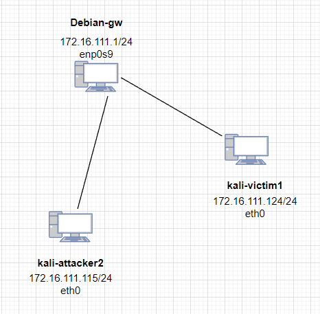
#### 2.环境布置
- 需要安装ufw，来控制端口状态。
    ```bash
    #安装ufw
    sudo apt-get upgrade
    sudo apt-get install ufw

    #端口状态控制
    #允许访问
    sudo ufw enable && ufw allow portno/tcp(udp)
    #过滤状态
    sudo ufw enable && ufw deny portno/tcp(udp)
    #关闭状态
    sudo ufw disable
    ```
#### 3.先述知识
- 端口状态
    开放✅
    关闭⛔
    被过滤⚠

## 实验过程
#### 1. TCP connect scan
##### I.编程实现
- ##### 代码
    ```bash
    #文件：tcp_connect_scan.py

    #! /usr/bin/python

    from scapy.all import *

    dst_ip = "172.16.111.124"
    src_port = RandShort()
    dst_port=8083

    tcpconnectscan_pkts = sr1(IP(dst=dst_ip)/TCP(sport=src_port,dport=dst_port,flags="S"),timeout=10)
    if tcpconnectscan_pkts is None:
        print("Filtered")
    elif(tcpconnectscan_pkts.haslayer(TCP)):
        if(tcpconnectscan_pkts.getlayer(TCP).flags == 0x12):
            print("Open")
        elif (tcpconnectscan_pkts.getlayer(TCP).flags == 0x14):
            print("Closed")
    ```
- ##### 结果
    - ###### closed
        kali_attacker2
        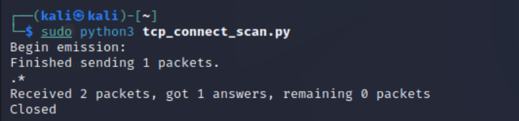
        kali_victim1-wireshark：收到RST/ACK数据包，证明端口处于关闭⛔状态，符合预期。
        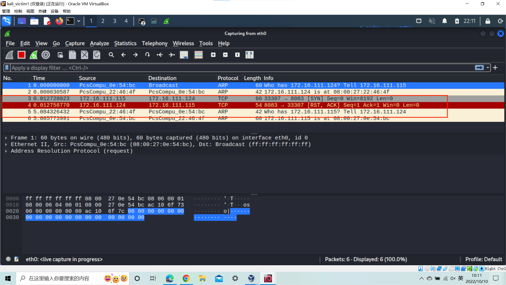
    - ###### filtered
        kali_attacker2
        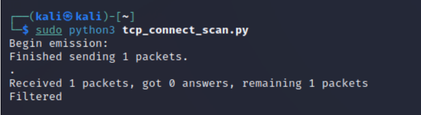
        kali_victim1-wireshark：只收到一个TCP包，靶机无反应，证明端口处于被过滤⚠状态，符合预期。
        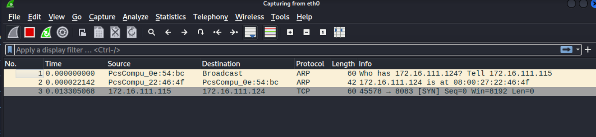 
    - ###### open
        kali_attacker2
        
        kali_victim1-wireshark：收到SYN/ACK数据包，证明端口处于开放✅状态，符合预期。
        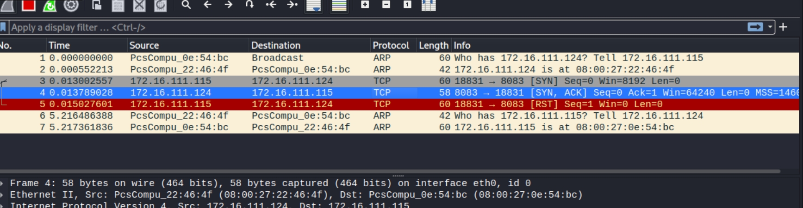 
##### II.nmap实现
- ##### 结果
    - ###### closed
        kali_attacker2
        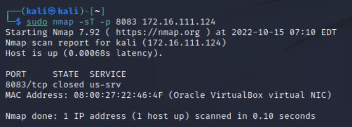
    - ###### filtered
        kali_attacker2
        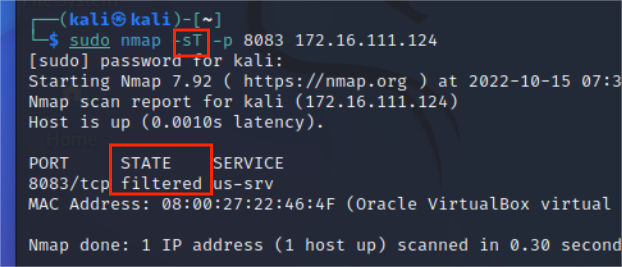
    - ###### open
        kali_attacker2
        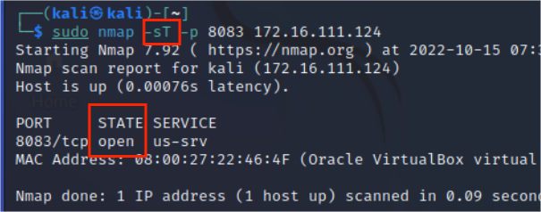

#### 2. TCP stealth scan
##### I.编程实现
- ##### 代码
    ```bash
    #文件：Tcp_stealth_scan.py

    #! /usr/bin/python

    import logging
    logging.getLogger("scapy.runtime").setLevel(logging.ERROR)

    from scapy.all import *

    dst_ip = "172.16.111.124"
    src_port = RandShort()
    dst_port = 8083

    tcpstealthscan_pkts = sr1(
        IP(dst=dst_ip)/TCP(sport=src_port, dport=dst_port, flags="S"), timeout=10)
    if tcpstealthscan_pkts is None:
        print("Filtered")
    elif(tcpstealthscan_pkts.haslayer(TCP)):
        if(tcpstealthscan_pkts.getlayer(TCP).flags == 0x12):
            send_rst = sr(IP(dst=dst_ip)/TCP(sport=src_port,dport=dst_port, flags="R"), timeout=10)
            print("Open")
        elif (tcpstealthscan_pkts.getlayer(TCP).flags == 0x14):
            print("Closed")
    elif(tcpstealthscan_pkts.haslayer(ICMP)):
        if(int(tcpstealthscan_pkts.getlayer(ICMP).type) == 3 and int(tcpstealthscan_pkts.getlayer(ICMP).code) in [1, 2, 3, 9, 10, 13]):
            print("Filtered")
    ```
- ##### 结果
    - ###### closed
        kali_attacker2
        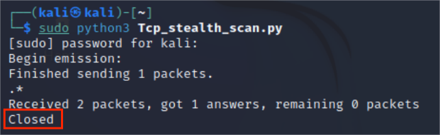
        kali_victim1-wireshark：收到RST/ACK数据包，证明端口处于关闭⛔状态，符合预期。
        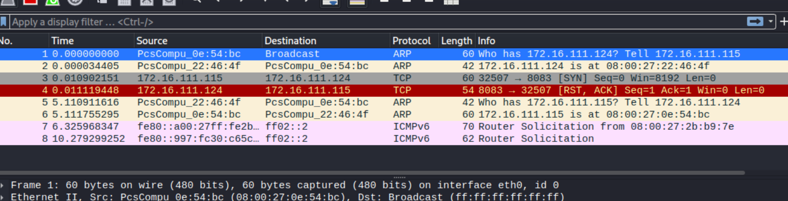
    - ###### filtered
        kali_attacker2
        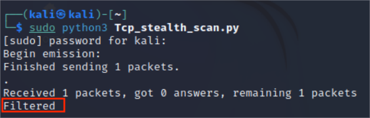
        kali_victim1-wireshark：只收到一个SYN包,证明端口处于被过滤⚠状态，符合预期。
        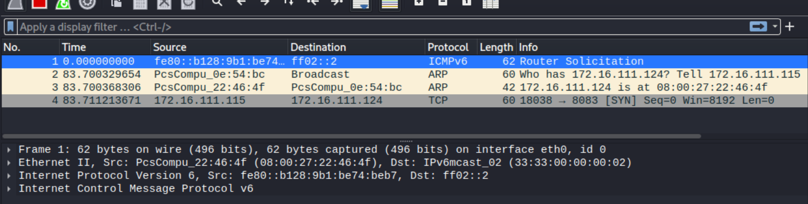 
    - ###### open
        kali_attacker2
        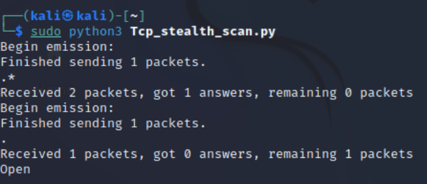
        kali_victim1-wireshark：收到SYN/ACK数据包，证明端口处于开放✅状态，符合预期。
        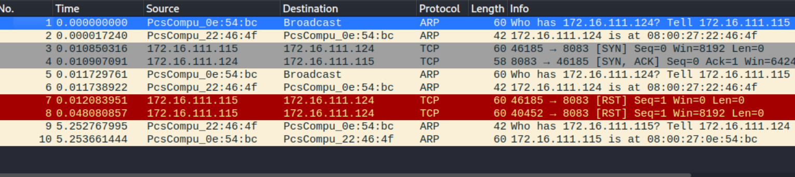 
##### II.nmap实现
- ##### 结果
    - ###### closed
        kali_attacker2
        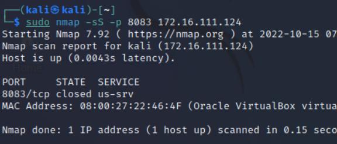
    - ###### filtered
        kali_attacker2
        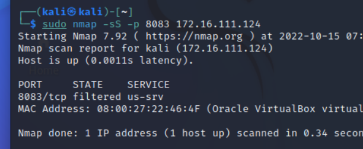
    - ###### open
        kali_attacker2
        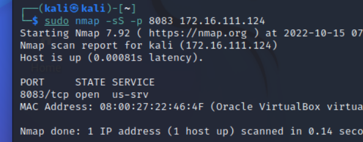

#### 3. TCP Xmas scan
##### I.编程实现
- ##### 代码
    ```bash
    #文件：tcp_xmas_scan.py

    #! /usr/bin/python

    import logging
    logging.getLogger("scapy.runtime").setLevel(logging.ERROR)

    from scapy.all import *

    dst_ip = "172.16.111.124"
    src_port = RandShort()
    dst_port = 8083

    tcpxmasscan_pkts = sr1(
        IP(dst=dst_ip)/TCP(dport=dst_port, flags="FPU"), timeout=10)
    if tcpxmasscan_pkts is None:
        print("Open|Filtered")
    elif(tcpxmasscan_pkts.haslayer(TCP)):
        if(tcpxmasscan_pkts.getlayer(TCP).flags == 0x14):
            print("Closed")
    elif(tcpxmasscan_pkts.haslayer(ICMP)):
        if(int(tcpxmasscan_pkts.getlayer(ICMP).type) == 3 and int(tcpxmasscan_pkts.getlayer(ICMP).code) in [1, 2, 3, 9, 10, 13]):
            print("Filtered") 
    ```
- ##### 结果
    - ###### closed
        kali_attacker2
        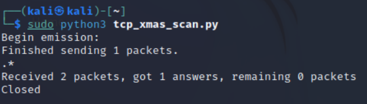
        kali_victim1-wireshark：收到RST/ACK数据包，证明端口处于关闭⛔状态，符合预期。
        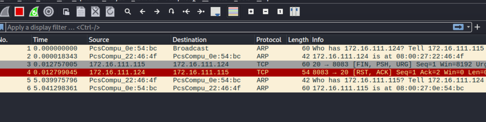
    - ###### filtered
        kali_attacker2
        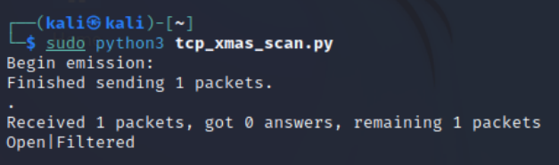
        kali_victim1-wireshark：只收到了一个TCP包，且靶机没有响应，证明端口处于过滤状态⚠，与预期相符
        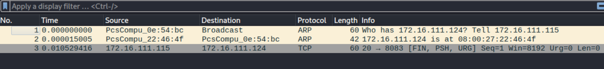 
    - ###### open
        kali_attacker2
        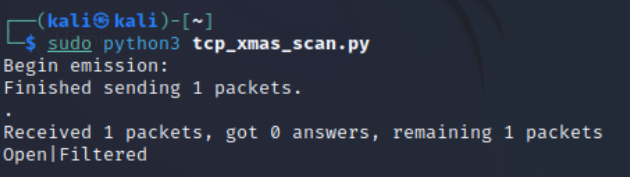
        kali_victim1-wireshark：只收到了一个TCP包，且靶机没有响应，证明端口处于开放✅状态，符合预期。
        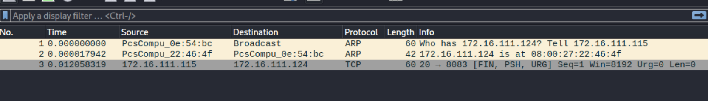 
##### II.nmap实现
- ##### 结果
    - ###### closed
        kali_attacker2
        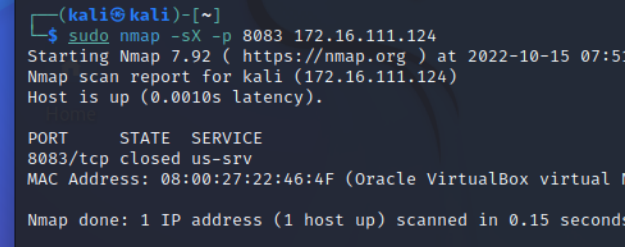
    - ###### filtered
        kali_attacker2
        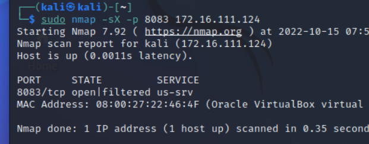
    - ###### open
        kali_attacker2
        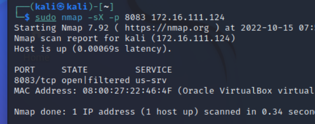

#### 4. TCP fin scan
##### I.编程实现
- ##### 代码
    ```bash
    #文件：tcp_fin_scan.py

    #! /usr/bin/python

    import logging
    logging.getLogger("scapy.runtime").setLevel(logging.ERROR)

    from scapy.all import *

    dst_ip = "172.16.111.124"
    src_port = RandShort()
    dst_port = 8083

    tcpfinscan_pkts = sr1(
        IP(dst=dst_ip)/TCP(dport=dst_port, flags="F"), timeout=10)
    if tcpfinscan_pkts is None:
        print("Open|Filtered")
    elif(tcpfinscan_pkts.haslayer(TCP)):
        if(tcpfinscan_pkts.getlayer(TCP).flags == 0x14):
            print("Closed")
    elif(tcpfinscan_pkts.haslayer(ICMP)):
        if(int(tcpfinscan_pkts.getlayer(ICMP).type) == 3 and int(tcpfinscan_pkts.getlayer(ICMP).code) in [1, 2, 3, 9, 10, 13]):
            print("Filtered")
    ```
- ##### 结果
    - ###### closed
        kali_attacker2
        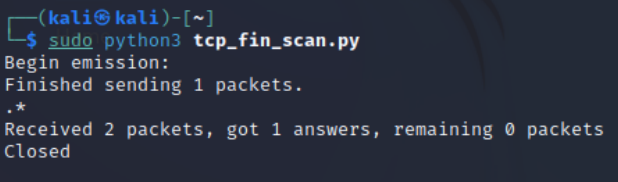
        kali_victim1-wireshark：收到RST/ACK数据包，证明端口处于关闭⛔状态，符合预期。
        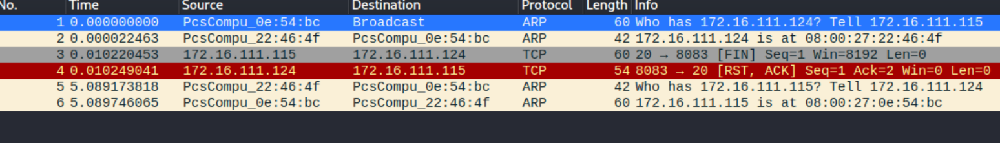
    - ###### filtered
        kali_attacker2
        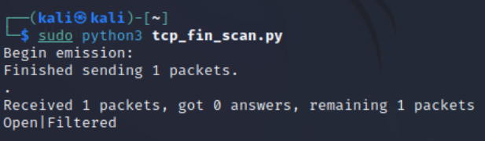
        kali_victim1-wireshark：只收到了一个TCP包，且靶机没有响应，证明端口处于过滤状态⚠，与预期相符
        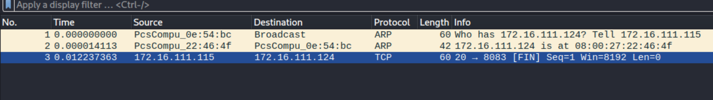 
    - ###### open
        kali_attacker2
        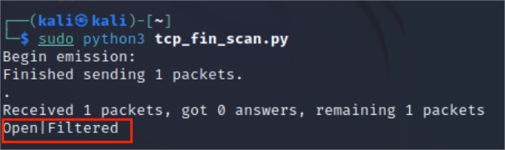
        kali_victim1-wireshark：只收到了一个TCP包，且靶机没有响应，证明端口处于开放✅状态，符合预期。
        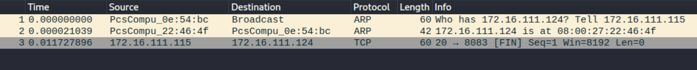 
##### II.nmap实现
- ##### 结果
    - ###### closed
        kali_attacker2
        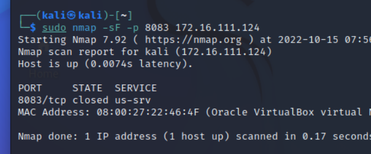
    - ###### filtered
        kali_attacker2
        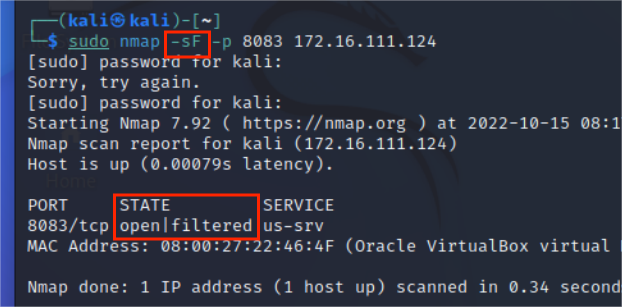
    - ###### open
        kali_attacker2
        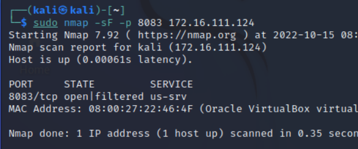

#### 5. TCP null scan
##### I.编程实现
- ##### 代码
    ```bash
    #文件：tcp_null_scan.py

    #! /usr/bin/python

    import logging
    logging.getLogger("scapy.runtime").setLevel(logging.ERROR)

    from scapy.all import *

    dst_ip = "172.16.111.124"
    src_port = RandShort()
    dst_port = 8083

    tcpnullscan_pkts = sr1(
        IP(dst=dst_ip)/TCP(dport=dst_port, flags=""), timeout=10)
    if tcpnullscan_pkts is None:
        print("Open|Filtered")
    elif(tcpnullscan_pkts.haslayer(TCP)):
        if(tcpnullscan_pkts.getlayer(TCP).flags == 0x14):
            print("Closed")
    elif(tcpnullscan_pkts.haslayer(ICMP)):
        if(int(tcpnullscan_pkts.getlayer(ICMP).type) == 3 and int(tcpnullscan_pkts.getlayer(ICMP).code) in [1, 2, 3, 9, 10, 13]):
            print("Filtered")
    ```
- ##### 结果
    - ###### closed
        kali_attacker2
        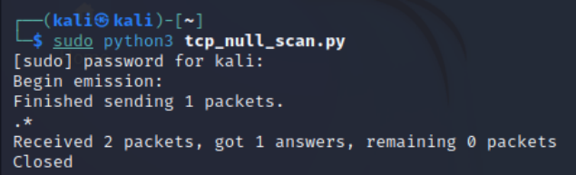
        kali_victim1-wireshark：收到RST/ACK数据包，证明端口处于关闭⛔状态，符合预期。
        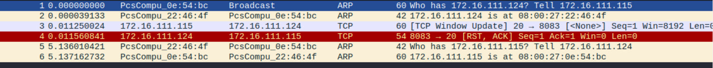
    - ###### filtered
        kali_attacker2
        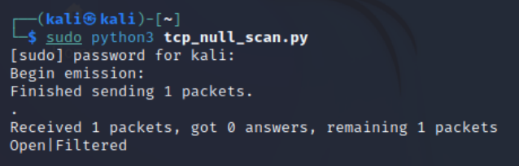
        kali_victim1-wireshark：只收到了一个TCP包，且靶机没有响应，证明端口处于过滤状态⚠，与预期相符
        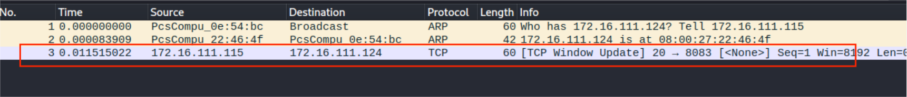 
    - ###### open
        kali_attacker2
        
        kali_victim1-wireshark：只收到了一个TCP包，且靶机没有响应，证明端口处于开放✅状态，符合预期。
        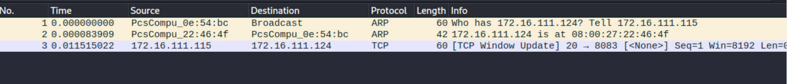 
##### II.nmap实现
- ##### 结果
    - ###### closed
        kali_attacker2
        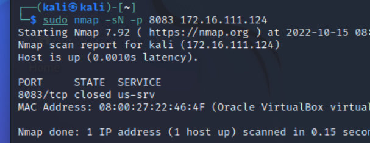
    - ###### filtered
        kali_attacker2
        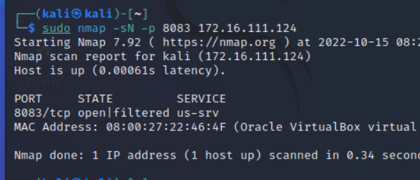
    - ###### open
        kali_attacker2
        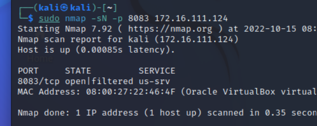

#### 6. TCP UDP scan
##### I.编程实现
- ##### 代码
    ```bash
    #文件：udp_scan.py

    #! /usr/bin/python

    import logging
    logging.getLogger("scapy.runtime").setLevel(logging.ERROR)

    from scapy.all import *

    dst_ip = "172.16.111.124"
    src_port = RandShort()
    dst_port = 53
    dst_timeout = 10

    def udp_scan(dst_ip,dst_port,dst_timeout):
        udp_scan_resp = sr1(IP(dst=dst_ip)/UDP(dport=dst_port), timeout=dst_timeout)
        if(udp_scan_resp is None):
            print("Open|Filtered")
        elif(udp_scan_resp.haslayer(UDP)):
            print("Open")
        elif(udp_scan_resp.haslayer(ICMP)):
            if(int(udp_scan_resp.getlayer(ICMP).type) == 3 and int(udp_scan_resp.getlayer(ICMP).code) == 3):
                print("Closed")
            elif(int(udp_scan_resp.getlayer(ICMP).type) == 3 and int(udp_scan_resp.getlayer(ICMP).code) in [1, 2, 9, 10, 13]):
                print("Filtered")
            elif(udp_scan_resp.haslayer(IP) and udp_scan_resp.getlayer(IP).proto == IP_PROTOS.udp)
                print("Open")

    udp_scan(dst_ip,dst_port,dst_timeout)
    ```
- ##### 结果
    - ###### closed
        kali_attacker2
        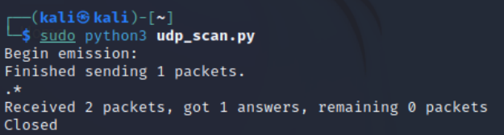
        kali_victim1-wireshark：收到ICMP“端口不可达”的包，证明端口处于关闭⛔状态，符合预期。
        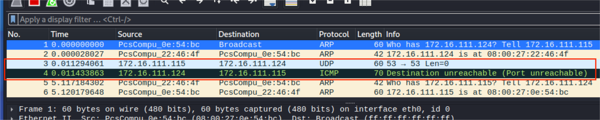
    - ###### filtered
        kali_attacker2
        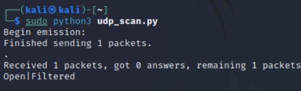
        kali_victim1-wireshark：只收到了一个UDP包，且靶机没有响应，证明端口处于过滤状态⚠，与预期相符
        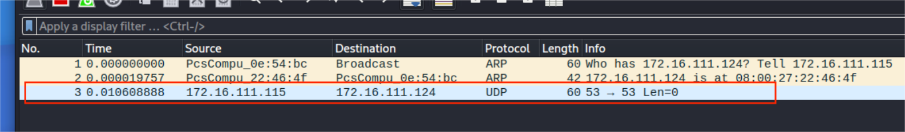 
    - ###### open
        kali_attacker2
        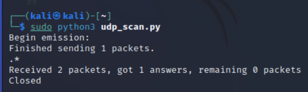
        kali_victim1-wireshark：只收到了一个UDP包，且靶机没有响应，证明端口处于开放✅状态，符合预期。
        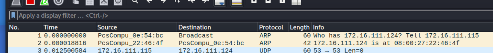 
##### II.nmap实现
- ##### 结果
    - ###### closed
        kali_attacker2
        
    - ###### filtered
        kali_attacker2
        
    - ###### open
        kali_attacker2
        
## 实验问题与解决方案
#### UDP端口无法打开
- 问题：在用UDPscan或者nmap复刻时都发现，如果kali_victim1只输入`sudo ufw enable && ufw allow 53/udp`,结果仍显示端口关闭/端口不可达。下图为开启端口后出现的结果：
    
- 解决方案：因为DNS服务基于UDP，在53端口提供服务，所以需要安装dnsmasq服务以开启udp端口。
    ```bash
    sudo apt install dnsmasq
    sudo systemctl start dnsmasq
    ```

## 参考资料
- [第五章 网络扫描](https://c4pr1c3.github.io/cuc-ns/chap0x05/main.html)
- [2020-ns-public-Crrrln](https://github.com/CUCCS/2020-ns-public-Crrrln/blob/chap0x05/chap0x05/exp5.md)
- [2021-ns-public-Tbc-tang](https://github.com/CUCCS/2021-ns-public-Tbc-tang/blob/chap0x05/0x05.md)
- [Kali Linux渗透测试之端口扫描（一）——UDP、TCP、隐蔽端口扫描、全连接端口扫描](https://blog.csdn.net/qq_38684504/article/details/89298654)
- [Kali-linux查看打开的端口](https://www.cnblogs.com/student-programmer/p/6727732.html)
- [Dnsmasq 部署 DNS 服务](https://zhuanlan.zhihu.com/p/336459065)
