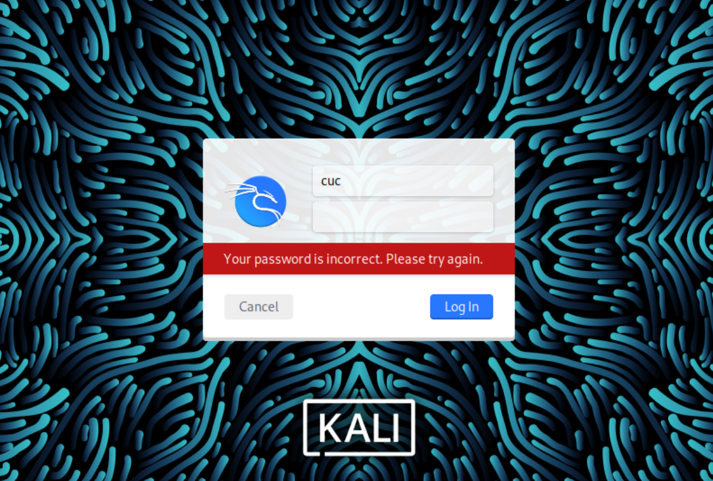

# 实验1 基于 VirtualBox 的网络攻防基础环境搭建
## 实验目的
  - 掌握 VirtualBox 虚拟机的安装与使用；
  - 掌握 VirtualBox 的虚拟网络类型和按需配置；
 -  掌握 VirtualBox 的虚拟硬盘多重加载；
## 实验环境
以下是本次实验需要使用的网络节点说明和主要软件举例：

- VirtualBox 虚拟机
- 攻击者主机（Attacker）：Kali Rolling 2019.2
- 网关（Gateway, GW）：Debian Buster
- 靶机（Victim）：From Sqli to shell / xp-sp3 / Kali

## 实验要求
- 虚拟硬盘配置成多重加载，效果如下图所示；


- 搭建满足如下拓扑图所示的虚拟机网络拓扑；


- 根据实验宿主机的性能条件，可以适度精简靶机数量

- 完成以下网络连通性测试；
- [ ] 靶机可以直接访问攻击者主机
- [ ] 攻击者主机无法直接访问靶机
- [ ] 网关可以直接访问攻击者主机和靶机
- [ ] 靶机的所有对外上下行流量必须经过网关
- [ ] 所有节点均可以访问互联网

## 实验过程


debian：
```
apt update
apt install dnsmasq
```

## 问题及解决方案
1. 无法登录kali
  根据视频用用户名```cuc```和密码```cuc```登录，显示失败。
  
  


## 参考资料
- [给非root用户赋予sudo权力](https://www.myfreax.com/how-to-add-and-delete-users-on-debian-9/#:~:text=%E5%9C%A8Debian%E4%B8%AD%EF%BC%8C%E6%9C%89%E4%B8%A4%E4%B8%AA%E5%8F%AF%E7%94%A8%E4%BA%8E%E5%88%9B%E5%BB%BA%E6%96%B0%E7%94%A8%E6%88%B7%E5%B8%90%E6%88%B7%E7%9A%84%E5%91%BD%E4%BB%A4%E8%A1%8C%E5%B7%A5%E5%85%B7%EF%BC%9A%20useradd%20%E5%92%8C%20adduser%20%E3%80%82%20useradd%20%E6%98%AF%E7%94%A8%E4%BA%8E%E6%B7%BB%E5%8A%A0%E7%94%A8%E6%88%B7%E7%9A%84%E4%BD%8E%E7%BA%A7%E5%AE%9E%E7%94%A8%E7%A8%8B%E5%BA%8F%EF%BC%8C%E8%80%8C%20adduser,%E6%98%AF%E7%94%A8Perl%E7%BC%96%E5%86%99%E7%9A%84%20useradd%20%E7%9A%84%E5%8F%8B%E5%A5%BD%E4%BA%A4%E4%BA%92%E5%BC%8F%E5%89%8D%E7%AB%AF%E3%80%82%20%E8%A6%81%E4%BD%BF%E7%94%A8%20adduser%20%E5%91%BD%E4%BB%A4%E5%88%9B%E5%BB%BA%E4%B8%80%E4%B8%AA%E5%90%8D%E4%B8%BA%20username%20%E7%9A%84%E6%96%B0%E7%94%A8%E6%88%B7%E5%B8%90%E6%88%B7%EF%BC%8C%E8%AF%B7%E8%BF%90%E8%A1%8C%EF%BC%9A)
- [Kali Linux初始账号和密码不知道怎么办？](https://www.bilibili.com/read/cv10217865/)
