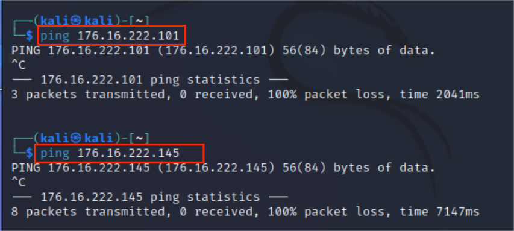

# 实验1 基于 VirtualBox 的网络攻防基础环境搭建
## 实验目的
  - 掌握 VirtualBox 虚拟机的安装与使用；
  - 掌握 VirtualBox 的虚拟网络类型和按需配置；
 -  掌握 VirtualBox 的虚拟硬盘多重加载；
## 实验环境

- VirtualBox 虚拟机
- 攻击者主机（Attacker）：Kali
- 网关（Gateway, GW）：Debian Buster
- 靶机（Victim）：Debian (victim1); xp(victim1,victim2); Kali(victim2)

## 实验要求
- 虚拟硬盘配置成多重加载，效果如下图所示；


- 搭建满足如下拓扑图所示的虚拟机网络拓扑；


- 根据实验宿主机的性能条件，可以适度精简靶机数量

- 完成以下网络连通性测试；
- [x] 靶机可以直接访问攻击者主机
- [x] 攻击者主机无法直接访问靶机
- [x] 网关可以直接访问攻击者主机和靶机
- [x] 靶机的所有对外上下行流量必须经过网关
- [x] 所有节点均可以访问互联网

## 实验过程
### 1.环境配置

- 多重加载

  在虚拟介质管理中，先释放已导入的虚拟磁盘文件，然后设置为多重加载，再添加到已创建的虚拟机中。
  
  
  
  添加两个例子(图中虚拟机已经完成第二步网卡配置）：
  - xp系统
 
    
    
  - debian系统
  
    
  
- 网卡配置

  - 对于作为网关的Debian虚拟机，设置四片网卡如下：

    
    
    在设置网卡一为NAT网络前，需要到全局设定-网络里添加新的NAT网络，结果如下：
    
    

    同时，为确保网卡二的正常运行，在主机网络管理器中确认是否启用了Host-Only网络：
    
    
    
  - 对于作为靶机的四台虚拟机，只需设置一片网卡，接入不同的内部网络即可。以xp-victim1举例，接入的网络是编号为intnet0的内部网络。
 
    
    
  - 对于作为攻击者的kali虚拟机，只需一片接入外部网络的网卡。
    
    
    
 - ip地址
    
    总地址如下表：
    
    |机器名|ip地址|
    |----|-----|
    |kali_victim1|172.16.111.124|
    |xp_victim1|172.16.111.101|
    |xp_victim2|172.16.222.101|
    |debian_victim2|172.16.222.145|
    |kali_attacker|10.0.2.5|
    
    - 网关：Debian_gw 
    
      
    
    - 靶机：
     
      1.kali_victim1
      
      
      
      2.xp_victim1
      
      对于xp系统，以其中一台靶机为例，需要手动在本地连接配置ip地址和dns服务器，并关闭防火墙（使得网关能够ping到靶机）
      
      
      
      ip地址如下：
      
      
      
      3.xp_victim2
      
      
      
      4.debian_victim2
      
      
      
    - 攻击者：
    
      
      
### 2.连通性测试

#### 1.靶机可以直接访问攻击者主机

以内部网络1（intnet0)的主机kali_victim1为例，可ping通攻击者主机：


以内部网络2（intnet1)的主机xp_victim2为例，可ping通攻击者主机：


#### 2.攻击者主机无法直接访问靶机

经测试，kali攻击者主机无法ping通靶机，情况如下：




#### 3.网关可以直接访问攻击者主机和靶机

经测试，网关可以ping通各个主机，情况如下：
  
  
  
  
  
  

#### 4.靶机的所有对外上下行流量必须经过网关
- 先在网关Debian虚拟机上安装tcpdump

  ```
  apt update
  apt install tcpdump
  ```
  
- 然后进行网络抓包。

  ```
  sudo tcpdump -i [希望抓取的网卡名称] -n -w [数据保存为的文件名称]
  ```

  

- 启用命令后，应该在相应网段的虚拟机上进行网络访问,这里以在debian_victim2中ping百度网站为例。

  

- 利用```scp```命令将文件传输到本地，在wireshark中进行分析，发现流量确实从网关通过。

  

#### 5.所有节点均可以访问互联网

- xp_victim1

  

- kali_victim1

  

- xp_victim2

  

- debian_victim2

  

- debian_gw

  
  
- kali_attacker

  

## 问题及解决方案
- 无法登录kali
  
  - 根据视频用用户名```cuc```和密码```cuc```登录，显示失败。
  
    

  - 解决方案：用户名```kali```,密码```kali```
 
- 无法远程登录root

  - 发现root账户不能通过ssh在本地登录，显示```Permission denied```。
  - 解决方案：搜索后得到，可以修改```sshd_config```中的```PermitRootLogin yes```，但鉴于安全风险，root账户一般不建议开启远程登录。最后采取的折中策略是，新建用户```robert```，并赋予sudo权力。（但因为后来放弃使用远程ssh登录，直接在虚拟机的小黑框里面输入指令，所以这个用户除了传输文件的时候都没有派上用场······）

## 参考资料
- [给非root用户赋予sudo权力](https://www.myfreax.com/how-to-add-and-delete-users-on-debian-9/#:~:text=%E5%9C%A8Debian%E4%B8%AD%EF%BC%8C%E6%9C%89%E4%B8%A4%E4%B8%AA%E5%8F%AF%E7%94%A8%E4%BA%8E%E5%88%9B%E5%BB%BA%E6%96%B0%E7%94%A8%E6%88%B7%E5%B8%90%E6%88%B7%E7%9A%84%E5%91%BD%E4%BB%A4%E8%A1%8C%E5%B7%A5%E5%85%B7%EF%BC%9A%20useradd%20%E5%92%8C%20adduser%20%E3%80%82%20useradd%20%E6%98%AF%E7%94%A8%E4%BA%8E%E6%B7%BB%E5%8A%A0%E7%94%A8%E6%88%B7%E7%9A%84%E4%BD%8E%E7%BA%A7%E5%AE%9E%E7%94%A8%E7%A8%8B%E5%BA%8F%EF%BC%8C%E8%80%8C%20adduser,%E6%98%AF%E7%94%A8Perl%E7%BC%96%E5%86%99%E7%9A%84%20useradd%20%E7%9A%84%E5%8F%8B%E5%A5%BD%E4%BA%A4%E4%BA%92%E5%BC%8F%E5%89%8D%E7%AB%AF%E3%80%82%20%E8%A6%81%E4%BD%BF%E7%94%A8%20adduser%20%E5%91%BD%E4%BB%A4%E5%88%9B%E5%BB%BA%E4%B8%80%E4%B8%AA%E5%90%8D%E4%B8%BA%20username%20%E7%9A%84%E6%96%B0%E7%94%A8%E6%88%B7%E5%B8%90%E6%88%B7%EF%BC%8C%E8%AF%B7%E8%BF%90%E8%A1%8C%EF%BC%9A)
- [使用root用户通过SSH登录Linux实例时报“Permission denied, please try again”的错误](https://help.aliyun.com/document_detail/41487.html)
- [Kali Linux初始账号和密码不知道怎么办？](https://www.bilibili.com/read/cv10217865/)
- [linux命令scp(复制文件和目录)详解及cp和scp命令的使用方法](https://blog.csdn.net/qq_34374664/article/details/81289540)
