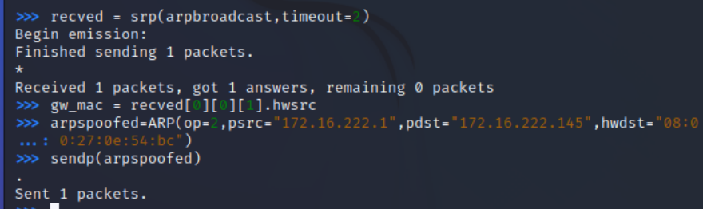

# 实验4 局域网主动监听实验
## 网络拓扑

- 攻击者主机
  - 08:00:27:0e:54:bc
  - 172.16.222.115
  
  
  
- 受害者主机
  - 08:00L27:db:5d:f0
  - 172.16.222.145
  
  
  
- 网关
  - 08:00:27:59:cf:53
  - 172.16.222.1
  
  

## 实验过程
### 实验一：检测局域网中的异常终端

1. 首先在攻击者主机上装好python3和scapy。

    ```bash
    #安装python3
    sudo apt update
    sudo apt install python3 python3-pip

    pip3 install scapy[complete]
    ```
  
2.  检查受害者主机的混杂模式是否开启。

    

    发现并没有启动（因为没有promisc）.接下来去攻击者主机开启```scapy```，并输入代码。

    

    回到受害者主机上开启网卡的“混杂模式”，并检查是否正确开启。

    


3.  正确开启后，再回到攻击者主机，输入：

    

    输出结果并不相同，当受害者主机打开网卡混杂模式后，攻击者的promiscping操作得到了正常的回应，返回结果是受害者主机的MAC地址和IP地址。

    最后手动关闭混杂模式。

    

  
### 实验二：手工单步“毒化”目标主机的 ARP 缓存
  
1.  在攻击者主机的```scapy```的交互式终端输入代码。
  
    

    然后发送ARP广播请求和相应数据包。

    ```bash
    # 发送这个 ARP 广播请求
    recved = srp(arpbroadcast, timeout=2)

    # 网关 MAC 地址如下
    gw_mac = recved[0][0][1].hwsrc

    # 伪造网关的 ARP 响应包
    arpspoofed=ARP(op=2, psrc="172.16.222.1", pdst="172.16.222.145", hwdst="08:00:27:0e:54:bc")

    # 发送上述伪造的 ARP 响应数据包到受害者主机
    send(arpspoofed)
    ```

    此时在受害者主机上查看 ARP 缓存会发现网关的 MAC 地址已被「替换」为攻击者主机的 MAC 地址

    
  
2.  恢复受害者主机的ARP缓存记录，需要攻击者主机假装网关给受害者发送：

    

    在受害者主机上，通过ping网关刷新记录。

     
   

### 实验三（可选）：使用自动化工具完成 ARP 投毒劫持实验
  
    在攻击者的scapy终端输入以下函数：

    

    结果如图：

    

    可以看到，通过自动化的脚本执行，成功完成对受害者的投毒。


## 实验问题与解决方案

1. scapy中无权限

- 问题：
     在初次登录scapy时，当输入

        ```bash
         pkt = promiscping("172.16.222.120")
        ```
  
      出现了无权限的报错。
  
      
  
- 解决方案：
        利用sudo su命令切换为root账号。
  
2. ARP缓存没有变化。

- 问题：
     在第一次把伪造的 ARP 响应数据包发送给受害者主机时，我使用了文档中所提的sendp命令。
    
     
    
     但是靶机上的ARP缓存没有发生任何变化。
        
     
        
- 解决方案：根据资料，将```sendp```改为```send```即可。原因可能是因为ARP协议独立于第二、第三层的特殊性，sendp是第二层的工具，而send是第三层的工具。

  
  
## 参考资料

- [课本——实验](https://c4pr1c3.github.io/cuc-ns/chap0x04/exp.html)
- [2021-ns-public-Tbc-tang
](https://github.com/CUCCS/2021-ns-public-Tbc-tang/blob/chap0x04/0x04.md)
  
- [Scapy模块](https://blog.csdn.net/dyx0910/article/details/124412639)
  
  
  
  
  
  
  
  
  
