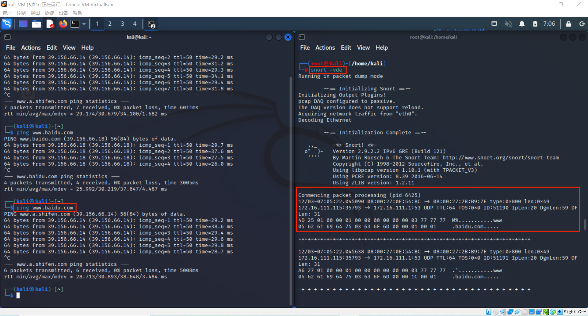
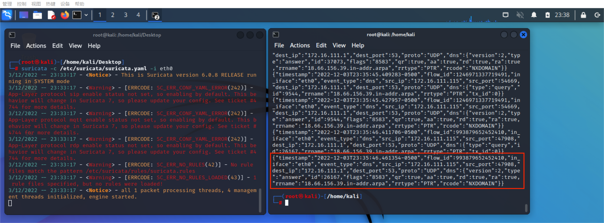
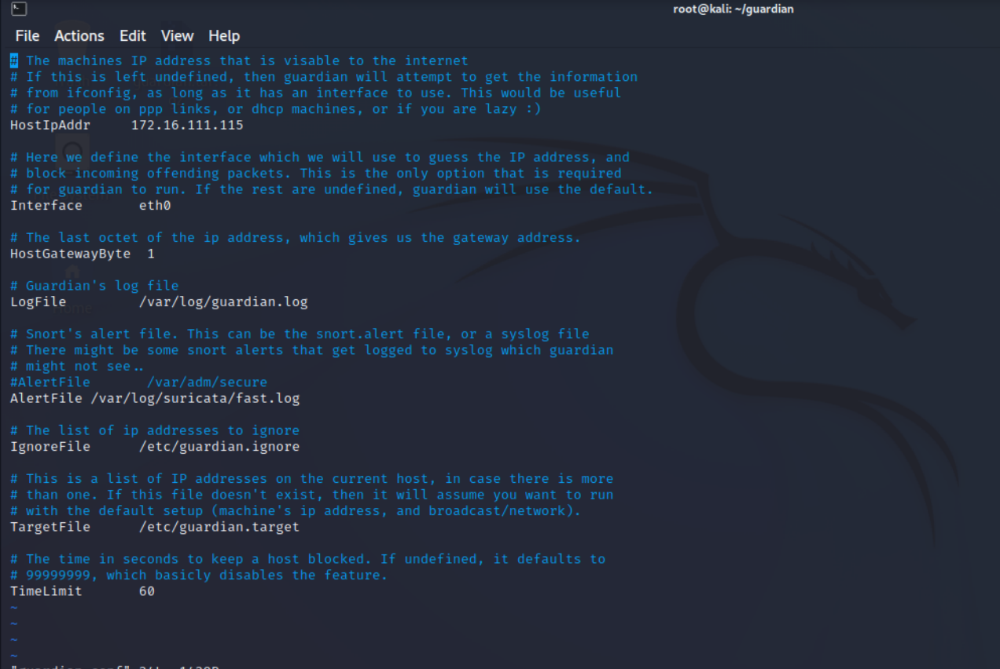

# 入侵检测
## 实验目的
- 利用snort和suricata尝试入侵检测
## 实验环境
- 网络拓扑图：

    

- 连通性测试：

    

## 实验过程
### 实验一：配置snort为嗅探状态
- 在kali_VM(受害者主机上）安装`snort`
    ```bash
    # 禁止在apt安装时弹出交互式配置界面
    export DEBIAN_FRONTEND=noninteractive

    apt install snort
    ```
- 用命令显示IP/TCP/UDP/ICMP头
    ```bash
    snort -v
    ```

    

- 显示应用层数据

    ```bash
    snort -vd
    ```

    - UDP头
        
    - ICMP头
        

- 显示数据链路层报文头
    ```bash
    snort -vde
    ```
    

- 进入嗅探模式
    ```bash
    # -b 参数表示报文存储格式为 tcpdump 格式文件
    # -q 静默操作，不显示版本欢迎信息和初始化信息
    snort -q -v -b -i eth0 "port not 22"

    # 使用 CTRL-C 退出嗅探模式
    # 嗅探到的数据包会保存在 /var/log/snort/snort.log.<epoch timestamp>
    # 其中<epoch timestamp>为抓包开始时间的UNIX Epoch Time格式串
    # 可以通过命令 date -d @<epoch timestamp> 转换时间为人类可读格式
    # exampel: date -d @1511870195 转换时间为人类可读格式
    # 上述命令用tshark等价实现如下：
    tshark -i eth0 -f "port not 22" -w 1_tshark.pcap
    ```
    

### 实验二：配置并启用snort内置规则
- 将`/etc/snort/snort.conf`中的 `HOME_NET` 和 `EXTERNAL_NET` 两个变量值均设置为 `any`

     

- 开始嗅探
    ```bash
    snort -q -A console -b -i eth0 -c /etc/snort/snort.conf -l /var/log/snort/
    ```

     

### 实验三：自定义snort规则
- 新建规则文件
    ```bash
    cat << EOF > /etc/snort/rules/cnss.rules
    alert tcp \$EXTERNAL_NET any -> \$HTTP_SERVERS 80 (msg:"Access Violation has been detected on /etc/passwd ";flags: A+; content:"/etc/passwd"; nocase;sid:1000001; rev:1;)
    alert tcp \$EXTERNAL_NET any -> \$HTTP_SERVERS 80 (msg:"Possible too many connections toward my http server"; threshold:type threshold, track by_src, count 100, seconds 2; classtype:attempted-dos; sid:1000002; rev:1;)
    EOF
    ```

     

- 添加配置到`/etc/snort/snort.conf`
    ```bash
    include $RULE_PATH/ccq_cnss.rules
    ```

     

- 开始嗅探。发现新产生的alert文件，打开验证，与新编写的rules中警告信息一致。
    ```bash
    snort -q -A fast -b -i eth0 -c /etc/snort/snort.conf -l /var/log/snort/
    ```

     

### 实验四：和防火墙联动
- 首先配置环境，并先开启snort嗅探。
    ```bash
    #获取guardian压缩包
    wget https://c4pr1c3.github.io/cuc-ns/chap0x09/attach/guardian.tar.gz

    #解压缩 Guardian-1.7.tar.gz
    tar zxf guardian.tar.gz

    #安装 Guardian 的依赖 lib
    apt install libperl4-corelibs-perl

    #在kali-victim中开启 snort
    snort -q -A fast -b -i eth0 -c /etc/snort/snort.conf -l /var/log/snort/
    ```
- 进入`guardian`文件夹，对`guardian.conf`中的`HostIpAddr`进行更改，改成受害者主机（安装snort的）的ip地址。

    ```bash
    #修改内容
    HostIpAddr      172.16.111.115
    Interface       eth0
    ```

     


- 启动 guardian.pl
    ```bash
    perl guardian.pl -c guardian.conf
    ```

- 在攻击者主机上，对受害者主机进行nmap扫描。注意要提前在受害者主机上开启`apache2`。

     

- 扫描结果出来之后，在受害者主机上查看`iptables`，`guardian.conf `中默认的来源IP被屏蔽时间是 60 秒，屏蔽期间如果黑名单上的来源IP再次触发snort报警消息，则屏蔽时间会继续累加60秒。下图上面为屏蔽时间之内的结果，下面为60s之后的结果。

     

## 实验思考题
### 1.IDS与防火墙的联动防御方式相比IPS方式防御存在哪些缺陷？是否存在相比较而言的优势？
IDS: 入侵检测系统，分析和监视网络流量，将当前的网络活动与已知的威胁数据库进行比较，以检测入侵行为、恶意软件和端口扫描程序等多种行为，检测代表着不会主动修改数据包。

IPS：入侵防御系统，与防火墙位于同一网络区域，检查数据包的内容，防御意味着会根据包的内容主动阻止包的传递。可以采取发送警报等措施，丢弃检测到的恶意数据包，重置连接或阻止来自违规IP地址的流量。还可以纠正循环冗余校验（CRC）错误，对数据包进行碎片整理，缓解TCP排序问题，并清理不需要的传输和网络层选项。

默认情况下，IDS/IPS 以混杂模式运行，这意味着设备捕获流量并将副本转发给 IDS/IPS 进行分析。因为处理的是流量副本，可以检测到攻击并发送警报（并采取其他操作），但不会阻止攻击进入网络或网段。而当 IPS 在内联(in-line)模式下工作时，它是直接工作在实际的流量路径中，可以检测威胁也可以进行防御。

缺陷：IDS是被动检测，即使检测到了入侵行为，也无法主动拦截防御。

优势：当IDS误报时，只会引起警报；当IPS误报时，会引起重要数据包的丢失。

### 2.使用 suricata 代替 Snort ，重复本实验
#### 安装suricata
```bash
sudo apt install suricata 
```
#### 实验一：配置 suricata 为嗅探模式
```bash
#查看版本
suricata -V


#开启监听eth0
suricata -c /etc/suricata/suricata.yaml -i eth0

#查看日志
#日志保存在/var/log/suricata/目录下
cd /var/log/suricata/
ls -l
#fast.log是报警日志文件
```

 

#### 实验二：配置并启用suricata内置规则
- 将`/etc/suricata/suricata.yaml`中的 `HOME_NET` 和 `EXTERNAL_NET` 两个变量值均设置为 `any`

     

- 开始监听，并查看当前日志
    ```bash
    suricata -c /etc/suricata/suricata.yaml -i eth0

    # 查看json格式的日志
    cat /var/log/suricata/eve.json
    ```
     

- 尝试着ping一下百度后，日志刷新，测试正常。

     

#### 实验三：自定义suricata规则
- 首先新建规则并将此文件加入到`suricata.yaml`中

    ```bash
    #新建自定义suricata规则文件
    vim /etc/suricata/rules/test.rules

    #修改内容如下
    alert tcp any any -> any any (msg:"hit baidu.com...";content:"baidu"; reference:url, www.baidu.com;)
    ```
     

- 然后，开启监听，用kali的浏览器访问百度，并查看eve.json日志，发现有alert标记，自定义规则匹配成功。

    

#### 实验四：和防火墙联动
- 首先要开启suricata，并修改`guardian.conf`文件的`alertFile`行将路径为`/var/log/suricata/fast.log`，然后开启`guardian.pl`。

    ```bash
    #相关代码
    sudo suricata -c /etc/suricata/suricata.yaml -i eth1 
    perl guardian.pl -c guardian.conf
    ```
    

- 为了让`nmap`扫描时`suricata`日志报警，配置`/etc/suricata/rules/ccq_alert.rules`自定义规则，并在`/etc/suricata/suricata.yaml`中加入该规则
    ```bash
    alert icmp any any -> 172.16.111.115 any (msg: "NMAP ping sweep Scan"; dsize:0;sid:10000002; rev: 1;)
    ```
- 在攻击者主机上扫描
    ```bash
    nmap 172.16.111.115 -A -T4 -n -vv
    ```
- 查看结果

### 3.配置 suricata 为 IPS 模式
- 首先对iptables的NFQUEUE进行设置，让Suricata 能访问到相应的数据包。
    ```bash
    sudo iptables -I INPUT -p tcp -j NFQUEUE 
    sudo iptables -I OUTPUT -p tcp -j NFQUEUE
    ```
    

- 让Suricata 以 IPS 模式运行（其中，-q 说明以 IPS 模式运行），查看iptables，发现在记录数据包。
    ```bash
    sudo suricata -c /etc/suricata/suricata.yaml -q 0 

    iptables -vnL
    ```
    

## 实验问题
- （未解决）suricata的实验四中，设置的rules似乎并没有让nmap成功触发警报。感觉思路是正确的，实践出现错误了。

## 参考资料

- [教材](https://c4pr1c3.github.io/cuc-ns/chap0x09/exp.html)

- [IDS vs. IPS: What is the Difference?](https://www.varonis.com/blog/ids-vs-ips)
- [2020-ns-public-Crrrln](https://github.com/CUCCS/2020-ns-public-Crrrln/blob/chap0x09/chap0x09/%E5%AE%9E%E9%AA%8C%E6%8A%A5%E5%91%8A.md)
